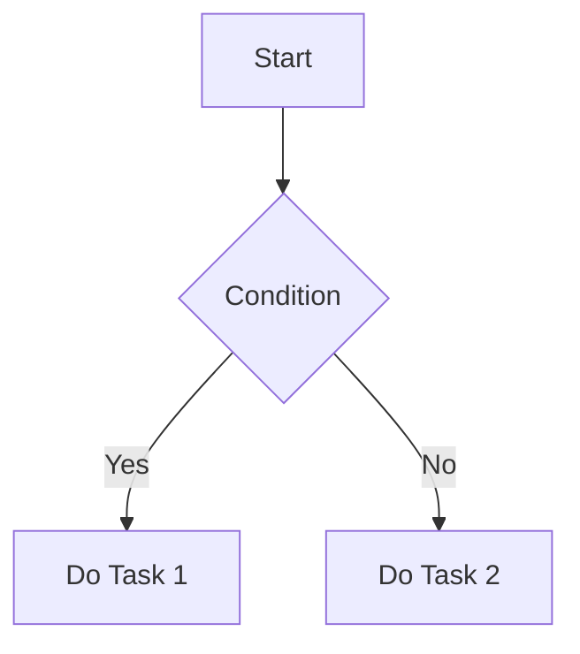
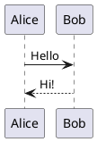

+++
title = 'Markdown Feature Test Document'
date = 2023-01-15T09:00:00-07:00
draft = false
tags = ['red']
+++

# Markdown Feature Test Document

## 1. Heading Levels

# H1 Heading

## H2 Heading

### H3 Heading

#### H4 Heading

##### H5 Heading

###### H6 Heading

---

## 2. Text Formatting

* **Bold text**
* *Italic text*
* ***Bold and italic text***
* ~~Strikethrough~~
* <u>Underlined text (via HTML)</u>
* `Inline code`

This is a sample paragraph used to test spacing, font rendering, and line breaks.
To start a new line, end the previous one with two spaces.

---

## 3. Blockquotes

> This is a first-level quote
>
> > This is a nested quote
> >
> > > Third-level quote

---

## 4. Lists

### Unordered List

* Item 1

  * Subitem 1.1
  * Subitem 1.2
* Item 2
* Item 3

### Ordered List

1. First item
2. Second item

   1. Sub-item A
   2. Sub-item B
3. Third item

---

## 5. Links and Images

### Links

[Standard link](https://example.com)
[Link with title](https://example.com "Example Title")
[https://example.com](https://example.com)

### Images


---

## 6. Code Blocks

### With Language Highlighting

```bash
# Shell example
echo "Hello, Markdown!"
```

```python
# Python example
def add(a, b):
    return a + b
```

```json
{
  "name": "Markdown Test",
  "version": "1.0.0"
}
```

---

## 7. Tables

| No. | Name   |           Description |
| :-: | :----- | --------------------: |
|  1  | Apple  |   Left alignment test |
|  2  | Banana | Center alignment test |
|  3  | Cherry |  Right alignment test |

---

## 8. Task Lists

* [x] Completed task
* [ ] Incomplete task
* [ ] Task in progress

---

## 9. Horizontal Rules

---

---

---

---

## 10. Footnotes and Superscripts

This is a sentence with a footnote.[^1]
E=mc^2^ demonstrates superscript usage.

[^1]: This is the footnote text.

---

## 11. Emoji and Symbols

😀 😎 👍 💡 ⚙️
©  ®  ×

---

## 12. Inline HTML

<div style="color:red;">This is red text (HTML rendering test)</div>

---

## 13. Collapsible Sections (GitHub-style)

<details>
  <summary>Click to expand</summary>

This is hidden content.
It may contain lists, code blocks, or images.

```js
console.log("Inside details");
```

</details>

---

## 14. Math Formulas (for MathJax/KaTeX)

Inline math: $E = mc^2$

Block math:

$$
\int_a^b f(x),dx = F(b) - F(a)
$$

---

## 15. Diagrams (Mermaid / PlantUML)





---

## 16. Comments and Escaping

<!-- This is a comment and should not be visible -->

*Asterisk escape example*
\Backslash example\

---

## 17. Multilingual Text

**English:** Hello world!
**Chinese:** 你好，世界！
**Japanese:** こんにちは世界！
**Korean:** 안녕하세요 세계!

---

## 18. File Paths and Commands

```
/home/user/project/test.md
C:\Program Files\example\run.exe
```

---

## 19. Mixed Example: Quote + List + Code

> **Example combination:**
>
> * Item One
> * Item Two
>
>   ```bash
>   echo "Nested code"
>   ```
> * Item Three

---

## 20. Final Section

Thank you for reading this Markdown test document.
Try rendering it in different parsers such as GitHub, Hugo, VSCode, Typora, or Obsidian to compare results.

