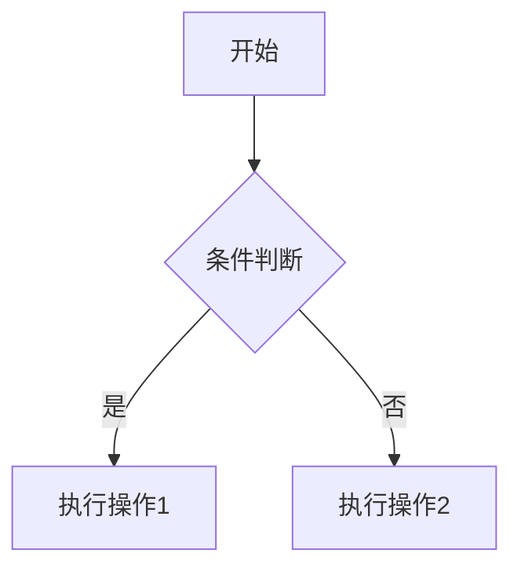
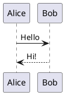

+++
title = 'Markdown 全功能测试文档'
date = 2023-01-15T09:00:00-07:00
draft = false
tags = ['red']
+++

# Markdown 全功能测试文档

## 1. 标题层级

# H1 一级标题

## H2 二级标题

### H3 三级标题

#### H4 四级标题

##### H5 五级标题

###### H6 六级标题

---

## 2. 文本样式

* **加粗文本**
* *斜体文本*
* ***粗斜体文本***
* ~~删除线~~
* <u>下划线（HTML支持）</u>
* `行内代码`

普通段落示例。这里是一些中文文本，用于测试段落间距与字体渲染。
另起一行时只需两个空格结尾。

---

## 3. 引用与嵌套引用

> 这是一级引用
>
> > 这是二级引用
> >
> > > 三级引用内容

---

## 4. 列表测试

### 无序列表

* 项目 1

  * 子项 1.1
  * 子项 1.2
* 项目 2
* 项目 3

### 有序列表

1. 第一项
2. 第二项

   1. 子项 A
   2. 子项 B
3. 第三项

---

## 5. 链接与图片

### 链接

[普通链接](https://example.com)
[带标题的链接](https://example.com "Example Title")
[https://example.com](https://example.com)

### 图片


---

## 6. 代码块

### 指定语言

```bash
# 这是一个 Shell 示例
echo "Hello, Markdown!"
```

```python
# Python 示例
def add(a, b):
    return a + b
```

```json
{
  "name": "Markdown Test",
  "version": "1.0.0"
}
```

---

## 7. 表格

|  序号 | 名称     |     说明 |
| :-: | :----- | -----: |
|  1  | Apple  | 左右对齐测试 |
|  2  | Banana | 居中对齐测试 |
|  3  | Cherry |  右对齐测试 |

---

## 8. 任务清单

* [x] 已完成任务
* [ ] 未完成任务
* [ ] 进行中任务

---

## 9. 分隔线

---

---

---

---

## 10. 脚注与上标

这是一个带脚注的句子[^1]。
E=mc^2^ 上标测试。

[^1]: 这是脚注内容。

---

## 11. Emoji 与特殊符号（若支持）

😀 😎 👍 💡 ⚙️
版权符号 ©
注册商标 ®
乘号 ×

---

## 12. HTML 混合支持

<div style="color: red;">这是一段红色文字（HTML 渲染测试）</div>

---

## 13. 折叠与详情（GitHub 支持）

<details>
  <summary>点击展开查看更多内容</summary>

这里是折叠内容。
可以包含列表、代码块或图片。

```js
console.log("inside details");
```

</details>

---

## 14. 数学公式（支持 MathJax 或 KaTeX 时）

行内公式：$E = mc^2$
块级公式：

$$
\int_a^b f(x),dx = F(b) - F(a)
$$

---

## 15. 引用外部资源（扩展）





---

## 16. 注释与转义字符

<!-- 这是HTML注释，不会显示 -->

*星号转义示例*
\反斜杠示例\

---

## 17. 多语言测试

**English:** Hello world!
**中文:** 你好，世界！
**日本語:** こんにちは世界！
**한국어:** 안녕하세요 세계!

---

## 18. 引用文件路径与命令行

```
/home/user/project/test.md
C:\Program Files\example\run.exe
```

---

## 19. Blockquote + Code + List 组合

> **示例组合：**
>
> * 项目一
> * 项目二
>
>   ```bash
>   echo "Nested code"
>   ```
> * 项目三

---

## 20. 完整结尾示例

感谢阅读此 Markdown 测试文档。
请使用不同的解析器（GitHub / Hugo / VSCode / Typora / Obsidian）对比渲染效果。
